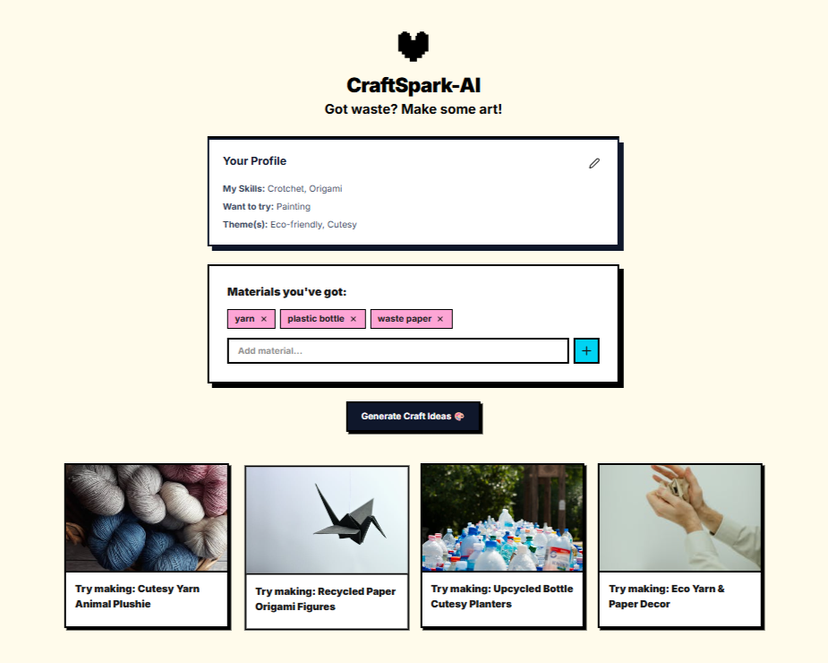
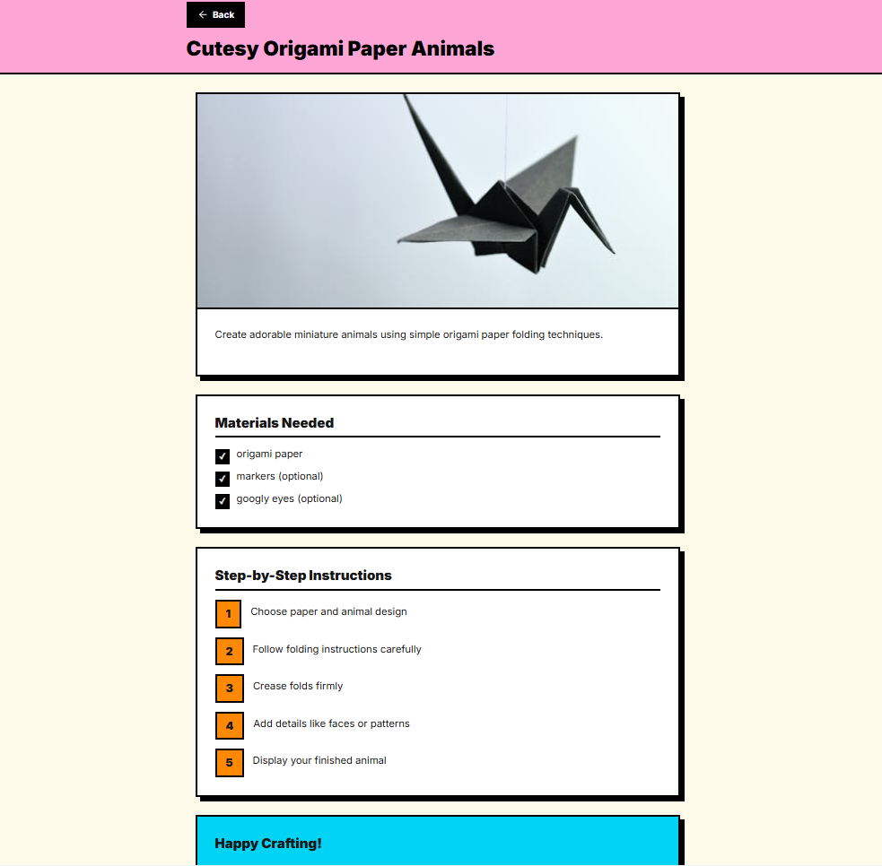

# CraftSpark-AI
Art and DIY craft idea generator powered by AI. Discover creative projects based on your skillset and recyclable materials.

🗑️ Got waste? Don't be afraid to recycle it into beautiful art! 🎨
## Tech Stack

[](https://react.dev)
[](https://nextjs.org)
[](https://twind.dev)
[](https://nodejs.org)
[](https://expressjs.com)
<!-- [](https://www.mongodb.com) -->

## Features

- AI-powered craft suggestion engine
- Click on a craft idea to get more details
- Save ideas and steps to profile
- SEO-optimized with Next.js

## Preview



## Status

🚧 More Features are being added.

👾 Currently using Gemini for AI text generation; future versions could integrate multiple models (Gemini, LLaMA 2, OpenAI GPT) with caching and queuing for scalability.

--- 

## 🚀 Server Execution Guide

**1. Install Dependencies**

```bash
cd CraftSpark-AI
npm install
```
**2. Create an env file and store GEMINI API KEY, PEXELS API KEY and URL in it.**

```bash
API_KEY = xxxxxxxxxxxxxxxxxxxx
PEXELS_API_KEY = xxxxxxxxxxxxxxxxxxxx
PEXELS_URL = xxxxxxxxxxxxxxxxxxxx
```
**3. Concurrently run the Development Server**

```bash
npm run dev
```
